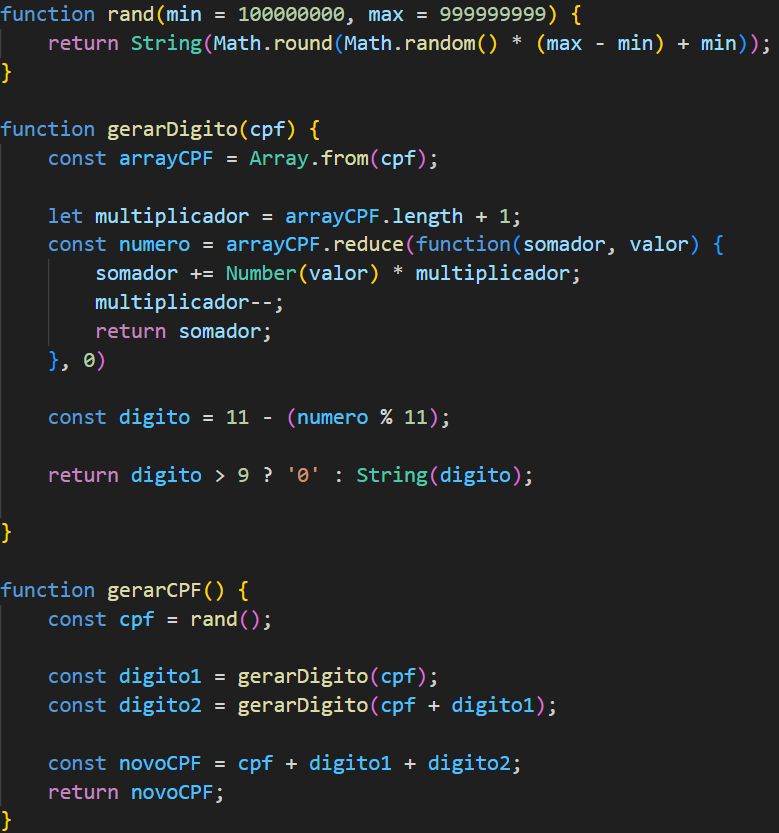

<h1>Gerador de CPF</h1>

Esse projeto gera um número de Cadstro de Pessoa Física (CPF) válido de forma aleatória.

<h2>Tecnologias utilizadas</h2>

<ul>
	<li>HTML5</li>
	<li>CSS3</li>
	<li>JavaScript</li>
	<li>Webpack</li>
	<li>Babel</li>
	<li>Visual Studio Code</li>
</ul>

<h2>Funcionalidades</h2>

<ul>
	<li>Geração de CPF válidos</li>
	<li>Exibição dos CPF gerados em formato convencional</li>
	<li>Interface intuitiva para o usuário gerar CPF com apenas um clique</li>
	<li>Código compatível com todos os navegadores</li>
</ul>

<h2>Como rodar o porjeto</h2>

<h3>Pré-requisitos</h3>

Certifique-se de que você tem o Node.js instalado em sua máquina. Caso não tenha, você pode instalá-lo <a href="https://nodejs.org/pt" target="_blank">aqui</a>.

<h3>Etapas</h3>

<ol>
	<li>Clone o repositório</li>
		<ol type="A">
			<li>Instale o Git (caso não tenha), clicando <a href="https://git-scm.com/">aqui</a>.</li>
			<li>Abra o terminal</li>
				<ul type="disc">
					<li>No Windows: Abra o <strong>Git Bash</strong> ou o <strong>Prompt de Comando</strong>.</li>
					<li>No macOS ou Linux: Abra o <strong>Terminal</strong>.</li>
				</ul>
			<li>Navegue até o diretório onde deseja clonar o repositório com o comando <strong>cd</strong></li>
			<li>No diretório escolhido digite o seguinte comando: <strong>git clone https://github.com/MatheusVenturaNellessen/generatorCPF.git</strong></li>
			<li>Acesse o repositório com o comando <strong>cd</strong></li>
		</ol>
	<li>Instale as depedências com o comando: <strong>npm install</strong></li>
	<li>Rode o Webpack com o comando: <strong>npm run dev</strong></li>
	<li>Por fim, abra o arquivo index.html em algum navegador</li>
</ol>

<h2>Como Funciona a Geração do CPF</h2>

A geração dos CPF é realizada de forma aleatória, mas garantindo que os CPF sejam válidos. O processo envolve gerar 9 números aleatórios e calcular os dois dígitos verificadores de acordo com as fórmulas de validação de CPF.

Abaixo está um exemplo simplificado de como a função de geração de CPF funciona:

 

<h2>Contribuições</h2>

Se você deseja contribuir com este projeto, sinta-se à vontade para abrir issues para discutir melhorias!

